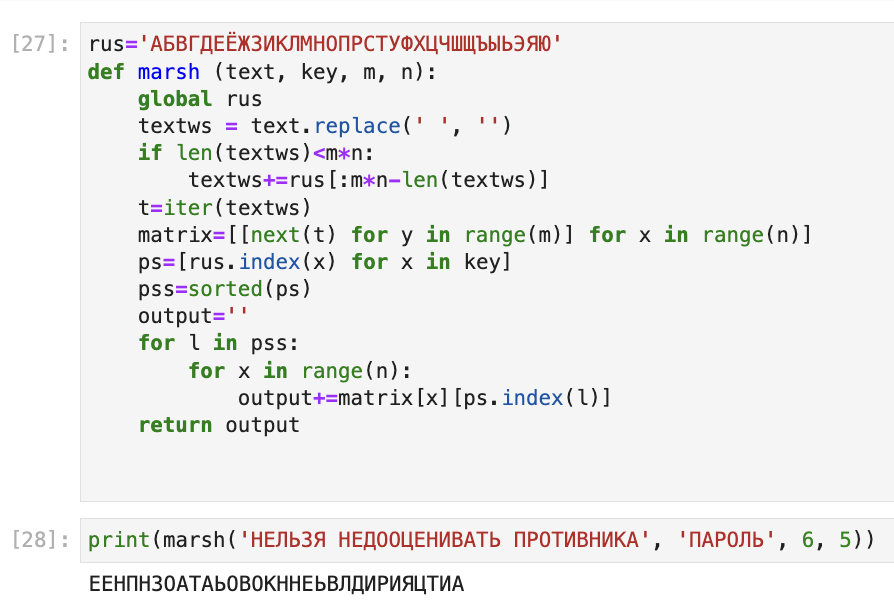
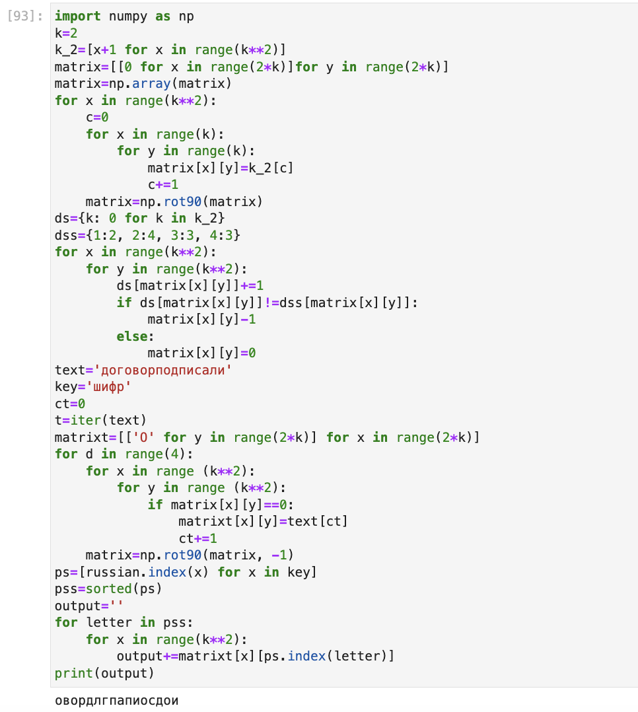
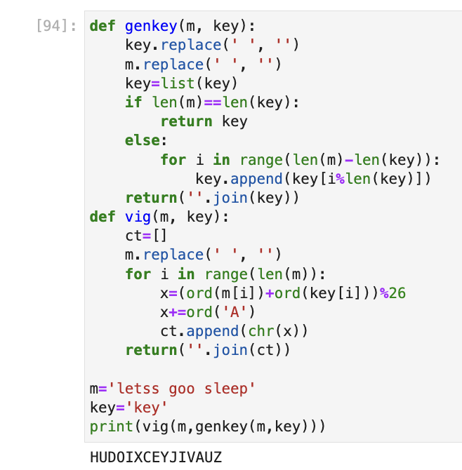

---
## Front matter
lang: ru-RU
title: Шифры перестановки
subtitle: Лабораторная работа №2
author:
  - Шутенко Виктория
institute:
  - Российский университет дружбы народов, Москва, Россия
date: 17 сентября 2023

## i18n babel
babel-lang: russian
babel-otherlangs: english

## Formatting pdf
toc: false
toc-title: Содержание
slide_level: 2
aspectratio: 169
section-titles: true
theme: metropolis
header-includes:
 - \metroset{progressbar=frametitle,sectionpage=progressbar,numbering=fraction}
 - '\makeatletter'
 - '\beamer@ignorenonframefalse'
 - '\makeatother'
---

# Информация

## Докладчик

:::::::::::::: {.columns align=center}
::: {.column width="70%"}

  * Шутенко Виктория михайловна
  * студентка Магистратуры
  * группы НФИмд-02-23
  * Российский университет дружбы народов

:::
::: {.column width="30%"}


:::
::::::::::::::

# Задание лабораторной работы

 1. Реализовать маршрутное шифрование. 
 2. Реализовать шифрование с помощью решеток.
 3. Реализовать шифрование методом Таблицы Виженера.

#  Маршрутное шифрование

## Код

:::::::::::::: {.columns align=center}
::: {.column width="60%"}

```Python
rus = 'АБВГДЕЁЖЗИКЛМНОПРСТУФХЦЧШЩЪЫЬЭЮЯ'
def marsh(text, key, m, n):
    global russian
    textws=text.replace(' ','')
    if len(textws)<m*n:
        textws+=rus[:m*n-len(textws)]
    t=iter(textws)
    matrix=[[next(t) for j in range (m)] 
        for i in range (n)]
```
:::
::: {.column width="50%"}


```Python
    ps=[rus.index(i) for i in key]
    pss=sorted(ps)
    output=''
    for l in pss:
        for i in range(n):
            output+=matrix[i][ps.index(l)]
    return output
print(marsh('нельзя недооценивать 
    противника', 'пароль', 6, 5))  
```
:::
::::::::::::::

## Вывод

{ #fig:001 width=70% }

#  Шифрование с помощью решеток

## Код


:::::::::::::: {.columns align=center}
::: {.column width="60%"}

```Python
import numpy as np
k=2
k_2=[x+1 for x in range(k**2)]
matrix=[[0 for x in range(2*k)]
    for y in range(2*k)]
matrix=np.array(matrix)
for x in range(k**2):
    c=0
    for x in range(k):
        for y in range(k):
            matrix[x][y]=k_2[c]
            c+=1
    matrix=np.rot90(matrix)
ds={k: 0 for k in k_2}
dss={1:2, 2:4, 3:3, 4:3}
for x in range(k**2):
    for y in range(k**2):
        ds[matrix[x][y]]+=1
        if ds[matrix[x][y]]!=dss[matrix[x][y]]:
            matrix[x][y]-1
```

:::
::: {.column width="50%"}

```Python
		else:
            matrix[x][y]=0
text='договорподписали'
key='шифр'
ct=0
t=iter(text)
matrixt=[['O' for y in range(2*k)] 
    for x in range(2*k)]
for d in range(4):
    for x in range (k**2):
        for y in range (k**2):
            if matrix[x][y]==0:
                matrixt[x][y]=text[ct]
                ct+=1
    matrix=np.rot90(matrix, -1)
ps=[russ.index(x) for x in key]
pss=sorted(ps)
output=''
for letter in pss:
    for x in range(k**2):
        output+=matrixt[x][ps.index(letter)]
print(output)
```

:::
::::::::::::::

        
## Вывод

{ #fig:002 width=70% }

#  Шифрование методом Таблицы Виженера

## Код

:::::::::::::: {.columns align=center}
::: {.column width="60%"}

```Python
def genkey(m, key):
    key.replace(' ', '')
    m.replace(' ', '')
    key=list(key)
    if len(m)==len(key):
        return key
    else:
        for i in range(len(m)-len(key)):
            key.append(key[i%len(key)])
    return(''.join(key))
```

:::
::: {.column width="50%"}

```Python
def vig(m, key):
    ct=[]
    m.replace(' ', '')
    for i in range(len(m)):
        x=(ord(m[i])+ord(key[i]))%26
        x+=ord('A')
        ct.append(chr(x))
    return(''.join(ct))
    
m='letss goo sleep'
key='key'
print(vig(m,genkey(m,key)))
```

:::
::::::::::::::

## Вывод

{ #fig:003 width=70% }
