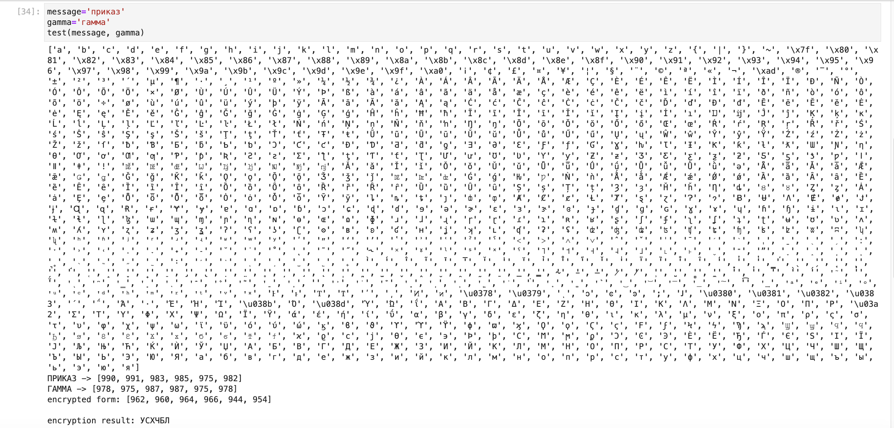

---
## Front matter
lang: ru-RU
title: Шифрование гаммированием
subtitle: Лабораторная работа №3
author:
  - Шутенко Виктория
institute:
  - Российский университет дружбы народов, Москва, Россия
date: 17 сентября 2023

## i18n babel
babel-lang: russian
babel-otherlangs: english

## Formatting pdf
toc: false
toc-title: Содержание
slide_level: 2
aspectratio: 169
section-titles: true
theme: metropolis
header-includes:
 - \metroset{progressbar=frametitle,sectionpage=progressbar,numbering=fraction}
 - '\makeatletter'
 - '\beamer@ignorenonframefalse'
 - '\makeatother'
---

# Информация

## Докладчик

:::::::::::::: {.columns align=center}
::: {.column width="70%"}

  * Шутенко Виктория михайловна
  * студентка Магистратуры
  * группы НФИмд-02-23
  * Российский университет дружбы народов

:::
::: {.column width="30%"}


:::
::::::::::::::

# Задание лабораторной работы

 1. Реализовать шифрование гаммированием. 
 
#  Шифрование гаммированием

## Код

:::::::::::::: {.columns align=center}
::: {.column width="10%"}

```Python
def get_alpha(option):
    if option=='eng':
        return list(map(chr,range(ord('a'), ord('z')+1)))
    elif option=='rus':
        return list(map(chr,range(ord('а'), ord('я')+1)))
    else:
        print('ошибка')
def gamma_encrypt (message: str, gamma: str):
    alph=get_alph('eng')
    if message.lower() not in alph: 
        alph=get_alph('rus')
    print(alph)
    m=len(alph)
    def encrypt(letters_pair: tuple):
        idx=(letters_pair[0]+1)+(letters_pair[1]+1)%m 
        if idx>m:
            idx=idx-m
        return idx-1
    message_clear=list(filter(lambda s: s.lower() in alph,message)) 
    gamma_clear=list(filter(lambda s: s.lower() in alph, gamma))
    message_ind=list(map(lambda s: alph.index(s.lower()),message_clear)) 
    gamma_ind=list(map (lambda s: alph.index(s.lower()),gamma_clear)) 
    for i in range(len(message_ind)-len(gamma_ind)):
        gamma_ind.append(gamma_ind[i])
    print(f'{message.upper()} -> {message_ind}\n{gamma.upper()} -> {gamma_ind}') 
    encrypted_ind=list(map(lambda s: encrypt(s),zip(message_ind,gamma_ind)))
    print(f'encrypted form: {encrypted_ind}\n')
    return ''.join(list(map(lambda s: alph[s],encrypted_ind))).upper()
def test(message: str, gamma: str):
    print(f'encryption result: {gamma_encrypt(message, gamma)}')
message='приказ'
gamma='гамма'
test(message, gamma)
```
:::
::: {.column width="50%"}


:::
::::::::::::::


## Код

:::::::::::::: {.columns align=center}
::: {.column width="100%"}

```Python
def gamma_encrypt (message: str, gamma: str):
    alph=get_alph('eng')
    if message.lower() not in alph: alph=get_alph('rus')
    print(alph)
    m=len(alph)
    def encrypt(letters_pair: tuple):
        idx=(letters_pair[0]+1)+(letters_pair[1]+1)%m 
        if idx>m: idx=idx-m
        return idx-1
    message_clear=list(filter(lambda s: s.lower() in alph,message)) 
    gamma_clear=list(filter(lambda s: s.lower() in alph, gamma))
    message_ind=list(map(lambda s: alph.index(s.lower()),message_clear)) 
    gamma_ind=list(map (lambda s: alph.index(s.lower()),gamma_clear)) 
    for i in range(len(message_ind)-len(gamma_ind)): gamma_ind.append(gamma_ind[i])
    print(f'{message.upper()} -> {message_ind}\n{gamma.upper()} -> {gamma_ind}') 
    encrypted_ind=list(map(lambda s: encrypt(s),zip(message_ind,gamma_ind)))
    print(f'encrypted form: {encrypted_ind}\n')
    return ''.join(list(map(lambda s: alph[s],encrypted_ind))).upper()
```
:::
::: {.column width="0%"}


:::
::::::::::::::


## Код

:::::::::::::: {.columns align=center}
::: {.column width="10%"}

```Python
def test(message: str, gamma: str):
    print(f'encryption result: {gamma_encrypt(message, gamma)}')
message='приказ'
gamma='гамма'
test(message, gamma)
```
:::
::: {.column width="50%"}


:::
::::::::::::::

## Вывод

{ #fig:001 width=70% }

