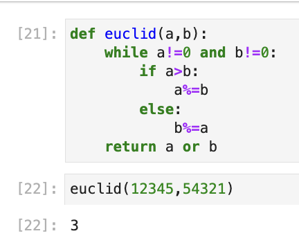
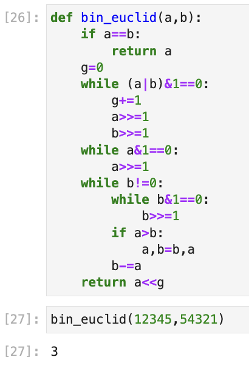
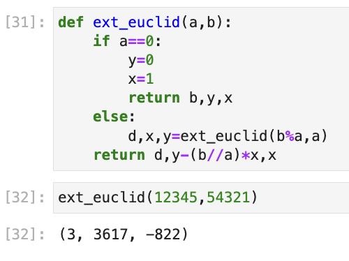
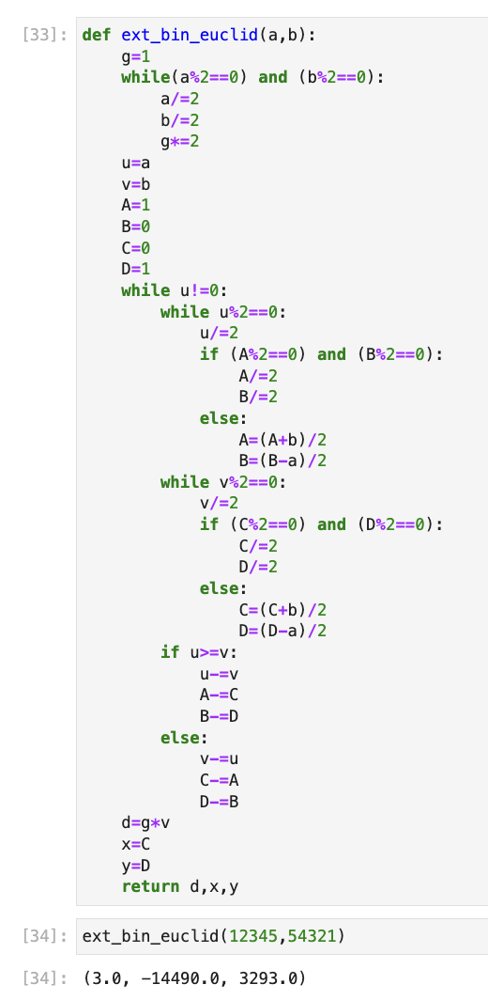

---
## Front matter
title: "Отчёт по лабораторной работе №4"
subtitle: "Алгориммы вычисления наибольшего общего делителя"
author: "Шутенко Виктория Михайловна"

## Generic otions
lang: ru-RU
toc-title: "Содержание"

## Bibliography
bibliography: bib/cite.bib
csl: pandoc/csl/gost-r-7-0-5-2008-numeric.csl

## Pdf output format
toc: true # Table of contents
toc-depth: 2
lof: true # List of figures
lot: false # List of tables
fontsize: 12pt
linestretch: 1.5
papersize: a4
documentclass: scrreprt
## I18n polyglossia
polyglossia-lang:
  name: russian
  options:
	- spelling=modern
	- babelshorthands=true
polyglossia-otherlangs:
  name: english
## I18n babel
babel-lang: russian
babel-otherlangs: english
## Fonts
mainfont: PT Serif
romanfont: PT Serif
sansfont: PT Sans
monofont: PT Mono
mainfontoptions: Ligatures=TeX
romanfontoptions: Ligatures=TeX
sansfontoptions: Ligatures=TeX,Scale=MatchLowercase
monofontoptions: Scale=MatchLowercase,Scale=0.9
## Biblatex
biblatex: true
biblio-style: "gost-numeric"
biblatexoptions:
  - parentracker=true
  - backend=biber
  - hyperref=auto
  - language=auto
  - autolang=other*
  - citestyle=gost-numeric
## Pandoc-crossref LaTeX customization
figureTitle: "Рис."
tableTitle: "Таблица"
listingTitle: "Листинг"
lofTitle: "Список иллюстраций"
lotTitle: "Список таблиц"
lolTitle: "Листинги"
## Misc options
indent: true
header-includes:
  - \usepackage{indentfirst}
  - \usepackage{float} # keep figures where there are in the text
  - \floatplacement{figure}{H} # keep figures where there are in the text
---


# Цель рабoты

Приoбрести практические навыки рабoты с алгоритмами вычисления наибольшего общего делителя.

# Хoд рабoты 

## Реализация алгоритма Евклида


```Python
def euclid(a,b):
    while a!=0 and b!=0:
        if a>b:
            a%=b
        else:
            b%=a
    return a or b
```  

{ #fig:001 width=100% }

## Реализация бинарного алгоритма Евклида


```Python
def bin_euclid(a,b):
    if a==b:
        return a
    g=0
    while (a|b)&1==0:
        g+=1
        a>>=1
        b>>=1
    while a&1==0:
        a>>=1
    while b!=0:
        while b&1==0:
            b>>=1
        if a>b:
            a,b=b,a
        b-=a
    return a<<g
```  

{ #fig:002 width=100% }

## Реализация расширенного алгоритма Евклида

```Python
def ext_euclid(a,b):
    if a==0:
        y=0
        x=1
        return b,y,x
    else:
        d,x,y=ext_euclid(b%a,a)
    return d,y-(b//a)*x,x
```  

{ #fig:003 width=100% }

## Реализация расширенного бинарного алгоритма Евклида

```Python
def ext_bin_euclid(a,b):
    g=1
    while(a%2==0) and (b%2==0):
        a/=2
        b/=2
        g*=2
    u=a
    v=b
    A=1
    B=0
    C=0
    D=1
    while u!=0:
        while u%2==0:
            u/=2
            if (A%2==0) and (B%2==0):
                A/=2
                B/=2
            else:
                A=(A+b)/2
                B=(B-a)/2
        while v%2==0:
            v/=2
            if (C%2==0) and (D%2==0):
                C/=2
                D/=2
            else:
                C=(C+b)/2
                D=(D-a)/2
        if u>=v:
            u-=v
            A-=C
            B-=D
        else:
            v-=u
            C-=A
            D-=B
    d=g*v
    x=C
    y=D
    return d,x,y
```  

{ #fig:004 width=100% }


