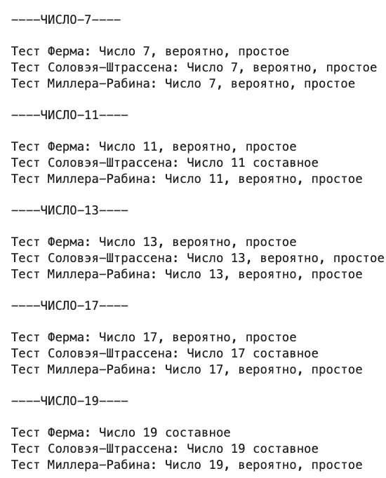
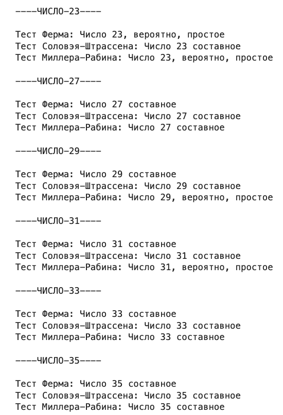

---
## Front matter
title: "Отчёт по лабораторной работе №5"
subtitle: "Вероятностные алгоритмы проверки чисел на простоту"
author: "Шутенко Виктория Михайловна"

## Generic otions
lang: ru-RU
toc-title: "Содержание"

## Bibliography
bibliography: bib/cite.bib
csl: pandoc/csl/gost-r-7-0-5-2008-numeric.csl

## Pdf output format
toc: true # Table of contents
toc-depth: 2
lof: true # List of figures
lot: false # List of tables
fontsize: 12pt
linestretch: 1.5
papersize: a4
documentclass: scrreprt
## I18n polyglossia
polyglossia-lang:
  name: russian
  options:
	- spelling=modern
	- babelshorthands=true
polyglossia-otherlangs:
  name: english
## I18n babel
babel-lang: russian
babel-otherlangs: english
## Fonts
mainfont: PT Serif
romanfont: PT Serif
sansfont: PT Sans
monofont: PT Mono
mainfontoptions: Ligatures=TeX
romanfontoptions: Ligatures=TeX
sansfontoptions: Ligatures=TeX,Scale=MatchLowercase
monofontoptions: Scale=MatchLowercase,Scale=0.9
## Biblatex
biblatex: true
biblio-style: "gost-numeric"
biblatexoptions:
  - parentracker=true
  - backend=biber
  - hyperref=auto
  - language=auto
  - autolang=other*
  - citestyle=gost-numeric
## Pandoc-crossref LaTeX customization
figureTitle: "Рис."
tableTitle: "Таблица"
listingTitle: "Листинг"
lofTitle: "Список иллюстраций"
lotTitle: "Список таблиц"
lolTitle: "Листинги"
## Misc options
indent: true
header-includes:
  - \usepackage{indentfirst}
  - \usepackage{float} # keep figures where there are in the text
  - \floatplacement{figure}{H} # keep figures where there are in the text
---


# Цель рабoты

Приoбрести практические навыки рабoты с вероятностными алгоритмами проверки чисел на простоту.

# Хoд рабoты 

## Реализация теста Ферма


```Python
def fermats(n: int):
    if n < 5:
        print("N should be greater or equal to 5")
        return
    
    a = np.random.choice(range(2, n-1))
    
    if (a**(n-1)) % n == 1:
        return "Число " + str(n) + ", вероятно, простое"
    else:
        return "Число " + str(n) + " составное"
```  


## Реалиазация символа Якоби


```Python
def yakobi(n: int, a: int):
    if n < 3:
        print("Число n должно быть больше или равно 3")
        return None
    
    if a < 0 or a >= n:
        print("Число a должны быть на интервале [0;n)")
        return None
    
    g = 1
    
    while a != 0 and a != 1:
        k = 0
        a_1 = a

        while divmod(a_1, 2)[1] != 1:
            a_1 = divmod(a_1, 2)[0]

        while (2**k)*a_1 != a:
            k += 1
        
        s = 1
        if k % 2 == 0:
            s = 1
        else:
            if (n == 1 % 8) or (n == -1 % 8):
                s = 1
            elif (n == 3 % 8) or (n == -3 % 8):
                s = -1
        
        if a_1 == 1:
            return g * s
        
        if (n == 3 % 4) and (a_1 == 3 % 4):
            s = -s

        a = n % a_1
        n = a_1
        g = g * s

    if a == 0:
        return 0
    else:
        return g
```  


## Реализация теста Соловэя-Штрассена

```Python
def soloway_shtrassen(n: int):
    if n % 2 == 0 or n < 5:
        return "Число " + str(n) + " составное"
    
    a = np.random.randint(2, n-1)
    r = int((a**((n-1)/2)) % n)
    
    if r != 1 and r != (n - 1):
        return "Число " + str(n) + " составное"
        
    s = yakobi(n, a)
    if r == s % n:
        return "Число " + str(n) + " составное"
    else:
        return "Число " + str(n) + ", вероятно, простое"
```  

## Реализация теста Миллера-Рабина

```Python
def miller_rabin(n: int):
    if n % 2 == 0 or n < 5:
        return "Число " + str(n) + " составное"
    
    r = n - 1
    s = 0
    
    while divmod(r, 2)[1] != 1:
        r = divmod(r, 2)[0]

    while (2**s)*r != n-1:
        s += 1
    
    a = np.random.randint(2, n-1)
    y = (a**r) % n
    
    if y != 1 and y != n - 1:
        j = 1
        while j <= s - 1 and y != n - 1:
            y = (y**2) % n
            if y == 1:
                return "Число " + str(n) + " составное"
            j = j + 1
        if y != n - 1:
            return "Число " + str(n) + " составное"
    
    return "Число " + str(n) + ", вероятно, простое"
```  

## Тестирование

```Python
def main():
    n = [7, 11, 13, 17, 19, 23, 27, 29, 31, 33, 35]
    
    for n_i in n:
        print(f'\n----ЧИСЛО-{n_i}----\n')
        print(f'Тест Ферма: {fermats(n_i)}')
        print(f'Тест Соловэя-Штрассена: {soloway_shtrassen(n_i)}')
        print(f'Тест Миллера-Рабина: {miller_rabin(n_i)}')
``` 

{ #fig:001 width=100% }

{ #fig:002 width=100% }


