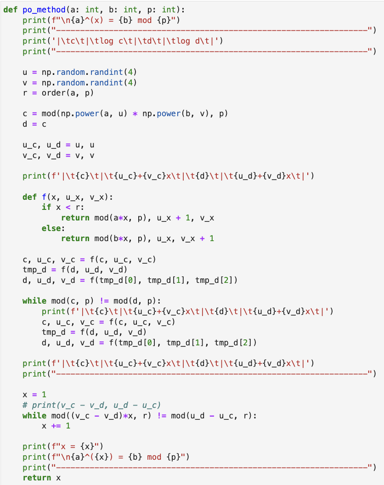
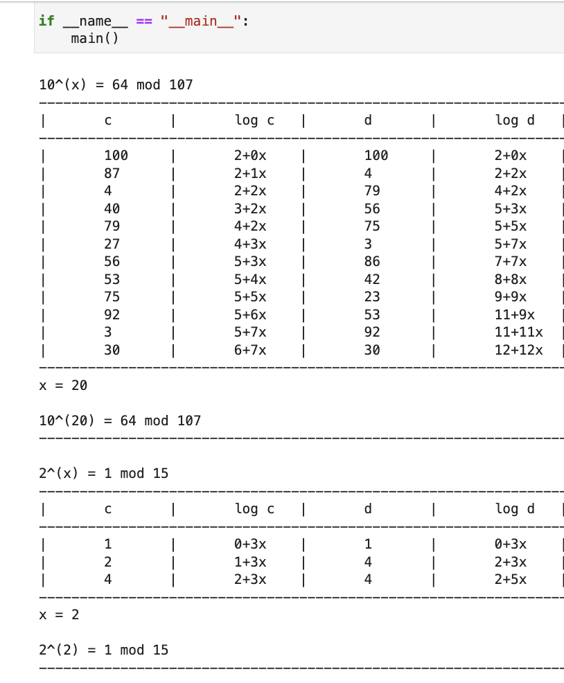

---
## Front matter
lang: ru-RU
title: Дискретное логарифмирование в конечном поле
subtitle: Лабораторная работа №7
author:
  - Шутенко Виктория
institute:
  - Российский университет дружбы народов, Москва, Россия
date: 17 сентября 2023

## i18n babel
babel-lang: russian
babel-otherlangs: english

## Formatting pdf
toc: false
toc-title: Содержание
slide_level: 2
aspectratio: 169
section-titles: true
theme: metropolis
header-includes:
 - \metroset{progressbar=frametitle,sectionpage=progressbar,numbering=fraction}
 - '\makeatletter'
 - '\beamer@ignorenonframefalse'
 - '\makeatother'
---

# Информация

## Докладчик

:::::::::::::: {.columns align=center}
::: {.column width="70%"}

  * Шутенко Виктория михайловна
  * студентка Магистратуры
  * группы НФИмд-02-23
  * Российский университет дружбы народов

:::
::: {.column width="30%"}

:::
::::::::::::::

# Задание лабораторной работы

1. Реализовать алгоритм, реализующий р-Метод Полларда для задач дискретного логарифмирования. 
 
#  Реализация алгоритма, реализующего р-метод Полларда для задач дискретного логарифмирования

{ #fig:001 width=100% }

# Результаты 

{ #fig:006 width=100% }

# Выводы

1. Реализован алгоритм, реализующий р-метод Полларда для задач дискретного логарифмирования.

