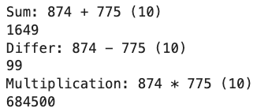

---
## Front matter
title: "Отчёт по лабораторной работе №8"
subtitle: "Целочисленная арифметика многократной точности"
author: "Шутенко Виктория Михайловна"

## Generic otions
lang: ru-RU
toc-title: "Содержание"

## Bibliography
bibliography: bib/cite.bib
csl: pandoc/csl/gost-r-7-0-5-2008-numeric.csl

## Pdf output format
toc: true # Table of contents
toc-depth: 2
lof: true # List of figures
lot: false # List of tables
fontsize: 12pt
linestretch: 1.5
papersize: a4
documentclass: scrreprt
## I18n polyglossia
polyglossia-lang:
  name: russian
  options:
	- spelling=modern
	- babelshorthands=true
polyglossia-otherlangs:
  name: english
## I18n babel
babel-lang: russian
babel-otherlangs: english
## Fonts
mainfont: PT Serif
romanfont: PT Serif
sansfont: PT Sans
monofont: PT Mono
mainfontoptions: Ligatures=TeX
romanfontoptions: Ligatures=TeX
sansfontoptions: Ligatures=TeX,Scale=MatchLowercase
monofontoptions: Scale=MatchLowercase,Scale=0.9
## Biblatex
biblatex: true
biblio-style: "gost-numeric"
biblatexoptions:
  - parentracker=true
  - backend=biber
  - hyperref=auto
  - language=auto
  - autolang=other*
  - citestyle=gost-numeric
## Pandoc-crossref LaTeX customization
figureTitle: "Рис."
tableTitle: "Таблица"
listingTitle: "Листинг"
lofTitle: "Список иллюстраций"
lotTitle: "Список таблиц"
lolTitle: "Листинги"
## Misc options
indent: true
header-includes:
  - \usepackage{indentfirst}
  - \usepackage{float} # keep figures where there are in the text
  - \floatplacement{figure}{H} # keep figures where there are in the text
---


# Цель рабoты

Изучить алгоритмы целочисленной арифметики многократной точности.

# Хoд рабoты 

## Программный код


```Python

def mod(a ,b):
	return a % b

def big_sum(u, v, b):
    u_ = str(u)
    v_ = str(v)
    
    j = len(u_) - 1
    
    if j != len(v_) - 1:
        print("bad N")
        return None
    
    k = 0
    
    w = ""
    
    while j >= 0:
        w_ = mod(int(u_[j]) + int(v_[j]) + k, b)
        w += str(w_)
        k = (int(u_[j]) + int(v_[j]) + k) // b
        j = j - 1
    
    w += str(k)
    return int(w[::-1])

def big_differ(u, v, b):
    u_ = str(u)
    v_ = str(v)
    
    j = len(u_) - 1
    
    if j != len(v_) - 1:
        print("bad N")
        return None
    
    k = 0
    
    w = ""
    
    while j >= 0:
        w_ = mod(int(u_[j]) - int(v_[j]) + k, b)
        w += str(w_)
        k = (int(u_[j]) - int(v_[j]) + k) // b
        j = j - 1

    return int(w[::-1])

def big_multiple(u, v, b):
    u_ = str(u)
    v_ = str(v)
    
    j = len(v_) - 1
    w = [0] * (j * len(u_))
    
    while j >= 0:
        if v_[j] == 0:
            w[j] = 0
            j = j - 1
        else:
            i = len(u_) - 1
            k = 0
            while i >= 0:
                t = int(u_[i]) * int(v_[j]) + w[i+j] + k
                w[i+j] = mod(t, b)
                k = t // b
                i = i - 1
            w[j] = k
            j = j - 1

    return int("".join(list(map(str, w))))


def main():
    x = 874
    y = 775
    
    print(f"Sum: {x} + {y} (10)")
    print(big_sum(x, y, 10))
    
    print(f"Differ: {x} - {y} (10)")
    print(big_differ(x, y, 10))
    
    print(f"Multiplication: {x} * {y} (10)")
    print(big_multiple(x, y, 10))
    
if __name__ == "__main__":
    main()

```  


{ #fig:001 width=100% }


