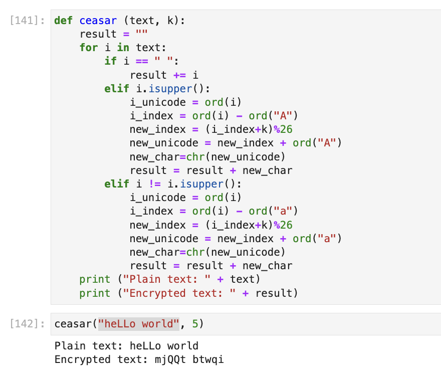
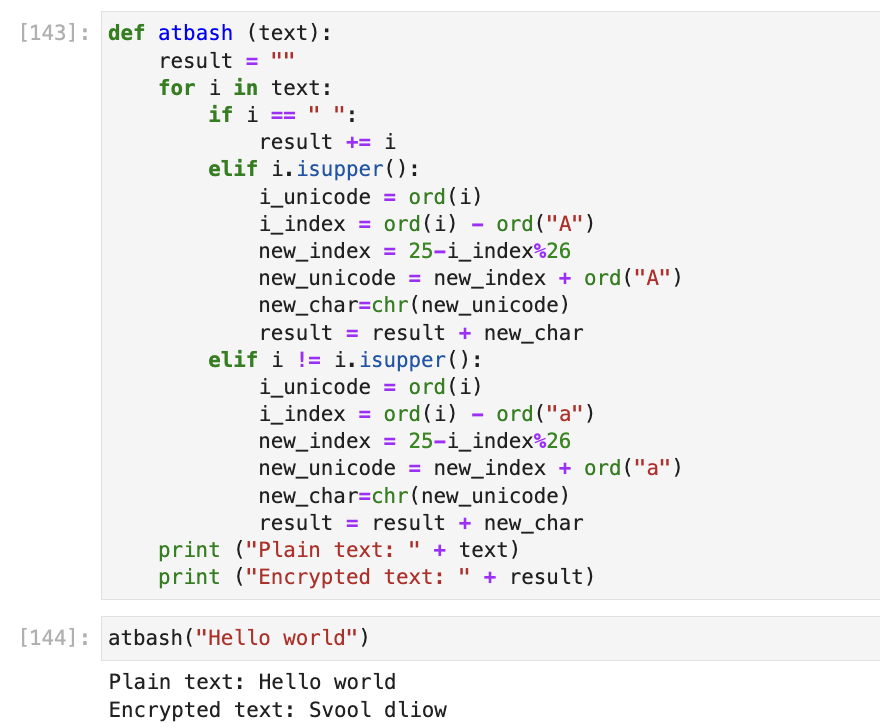

---
## Front matter
lang: ru-RU
title: Шифры простой замены
subtitle: Лабораторная работа №1
author:
  - Шутенко Виктория
institute:
  - Российский университет дружбы народов, Москва, Россия
date: 11 сентября 2023

## i18n babel
babel-lang: russian
babel-otherlangs: english

## Formatting pdf
toc: false
toc-title: Содержание
slide_level: 2
aspectratio: 169
section-titles: true
theme: metropolis
header-includes:
 - \metroset{progressbar=frametitle,sectionpage=progressbar,numbering=fraction}
 - '\makeatletter'
 - '\beamer@ignorenonframefalse'
 - '\makeatother'
---

# Информация

## Докладчик

:::::::::::::: {.columns align=center}
::: {.column width="70%"}

  * Шутенко Виктория михайловна
  * студентка Магистратуры
  * группы НФИмд-02-23
  * Российский университет дружбы народов

:::
::: {.column width="30%"}


:::
::::::::::::::

# Задание лабораторной работы

 1. Реализовать шифр Цезаря с произвольным ключом k. 
 2. Реализовать шифр Атбаш.

#  Шифр Цезаря

## Код

```Python
def ceasar (text, k):
    result = ""
    for i in text:
        if i == " ":
            result += i
        elif i.isupper():
            i_unicode = ord(i)
            i_index = ord(i) - ord("A")
            new_index = (i_index+k)%26
            new_unicode = new_index + ord("A")
            new_char=chr(new_unicode)
            result = result + new_char
        elif i != i.isupper():
            i_unicode = ord(i)
            i_index = ord(i) - ord("a")
            new_index = (i_index+k)%26
            new_unicode = new_index + ord("a")
            new_char=chr(new_unicode)
            result = result + new_char
    print ("Plain text: " + text)
    print ("Encrypted text: " + result)
```
#  Шифр Цезаря

## Вывод

{ #fig:001 width=70% }s://ctan.org/pkg/beamer)

#  Шифр Атбаш

## Код


```
def atbash (text):
    result = ""
    for i in text:
        if i == " ":
            result += i
        elif i.isupper():
            i_unicode = ord(i)
            i_index = ord(i) - ord("A")
            new_index = 25-i_index%26
            new_unicode = new_index + ord("A")
            new_char=chr(new_unicode)
            result = result + new_char
        elif i != i.isupper():
            i_unicode = ord(i)
            i_index = ord(i) - ord("a")
            new_index = 25-i_index%26
            new_unicode = new_index + ord("a")
            new_char=chr(new_unicode)
            result = result + new_char
    print ("Plain text: " + text)
    print ("Encrypted text: " + result)
```

## Вывод

{ #fig:002 width=70% }